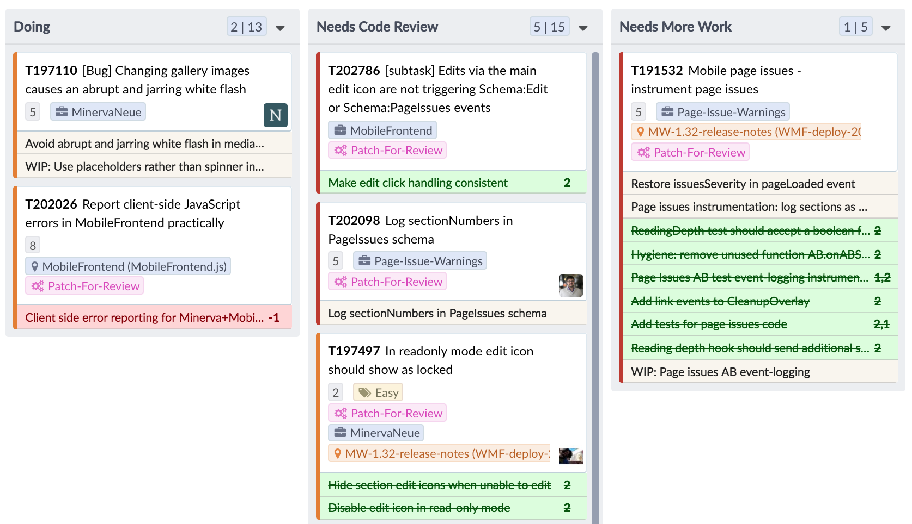

# Pherrit




A browser extension that modifies Phabricator workboards for the Wikimedia Foundation to show Gerrit tickets related to each task. Gerrit tickets are linked to Phab tasks by writing the words `Bug: [[ticket number]]` in the Gerrit commit message.

## Quickstart
The repo contains a small express application in `proxy.js` which routes all Phabricator and Gerrit requests to localhost
and appends the Pherrit scripts and styles to the Phabricator HTML response. This bypasses the CORS and CSP restrictions
and simulates the capabilities of the browser extension (which, by virtue of being an extension, also bypass CORS and CSP).

This will start webpack in dev-mode, start `proxy.js` and open a browser to http://localhost:3000/
(i.e. the proxied Phabricator homepage with the appended script and styles). From there you can navigate to any valid Phabricator workboard, (e.g. http://localhost:3000/project/view/3792/ ).
```
npm install && npm run start
```

To create a Chrome extension bundle, run:
```
npm run build
```
This will minify and zip the scripts and styles as well as the manifest.json file into `dist/pherrit-chrome-ext.zip`. Note: To update the extension in the
Chrome store, you have to manually bump up the version in `src/manifest.json`.

## TODO

### Code Quality
* [ x ] Add linter
* [ ] Write the JSDocs
* [ x ] Introduce Babel & webpack
    * [ X ] Write the webpack config
* [ x ] Put the core business logic into a `lib` directory and leave the `chrome` dir for extension specific stuff
* [ ] Figure out a testing strategy

### Bugs
* [ ] What happens when a patch is related to more than one ticket?
* [ ] Gerrit has a limit on query parameters, split the query into multiple network requests and wait for them all to resolve before continuing (hope throttling is not an issue)

### Features
* [ X ] Order the patches by "most needing code-review" so unreviewed & -1, first. Merged, abandoned last (or something like that)
* [ X ] Collapse merged patches when there are too many of them
* [ X ] Add more styles for WIP, merged, abandoned patches (lay them all out in all combinations)
* [ X ] Add a "+" before the number when something is +1 or +2
* [ ] Add a chrome button to turn it on and off
